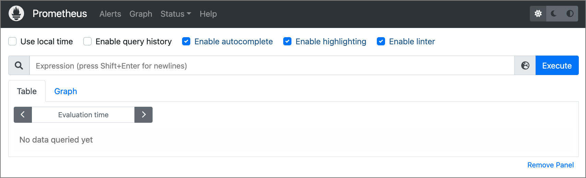
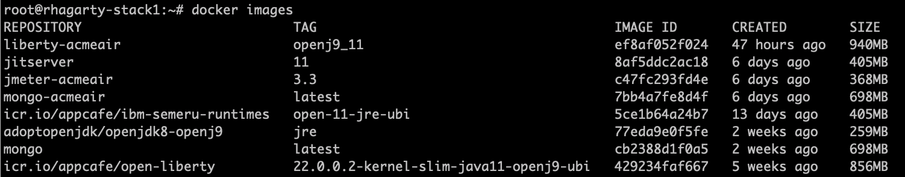
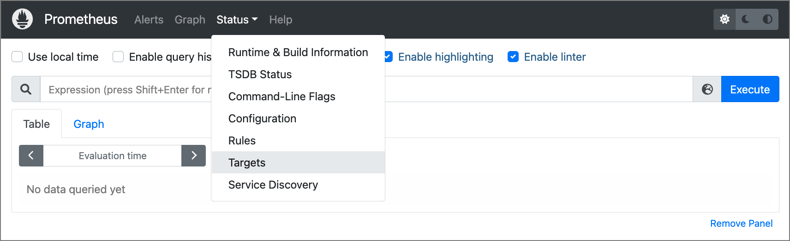
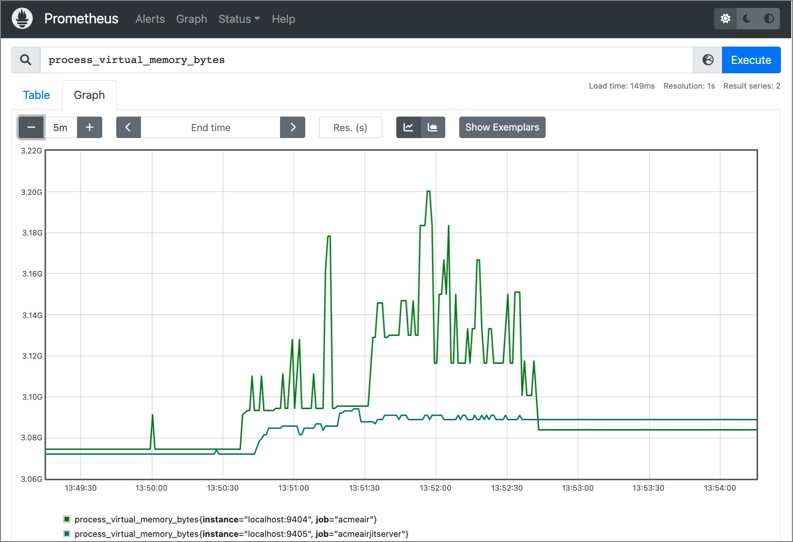
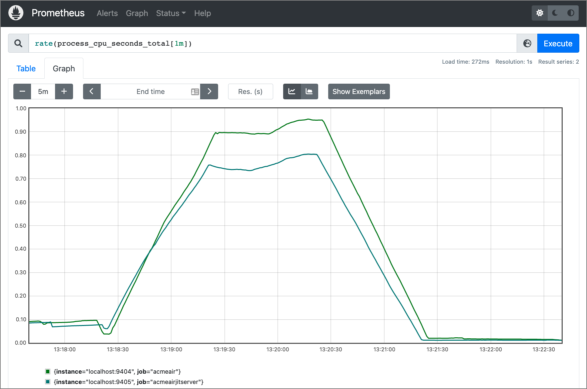

# Use the Acme Air web app to demonstrate the effectiveness of the Eclipse OpenJ9 JITServer

With the current trend of migrating applications to the cloud, a new set of challenges have emerged - namely related to performance and cost. The article ["JITServer - optimize your Java Cloud Native applications"](https://github.com/rhagarty/jitserver-intro) proposes that the OpenJ9 JITServer is a great solution to address both of these issues. The article states that with the use of the [JITServer](https://www.eclipse.org/openj9/docs/jitserver/) (included with the [Eclipse OpenJ9 JVM](https://www.eclipse.org/openj9/)), it is possible to ensure the high Quality of Service (QoS) that clients demand, while also lowering costs through better use of managed container resources.

In this tutorial, we will test that theory.

The test will consist of running multiple versions of the [AcmeAir](https://github.com/acmeair/acmeair) web application, each running in its own container. One version will be using a standard OpenJ9 JVM with an internal JIT compiler, and the other will be accessing a remote JITServer, running in a separate container.

We will be using [JMeter](https://jmeter.apache.org/) to simulate load on the containers, and [Prometheus](https://prometheus.io/docs/introduction/overview/) to monitor the container metrics.

## Host system

For our experiment, I provisioned a VM with the following specs:

* Ubuntu 20.04 LTS
* 4 Core 8GB RAM
* 250GB Disk

# Steps

1. [Install Prometheus](#1-install-prometheus)
1. [Install Docker](#2-install-docker)
1. [Clone the repo](#3-clone-the-repo)
1. [Install Prometheus JMX exporter](#4-install-prometheus-jmx-exporter)
1. [Build images from Dockerfiles](#5-build-images-from-dockerfiles)
1. [Run images in Docker containers](#6-run-images-in-docker-containers)
1. [Verify JITServer is responding](#7-verify-jitserver-is-responding)
1. [Verify Acme Air web app is running](#8-verify-acme-air-web-app-is-running)
1. [Configure Prometheus](#9-configure-prometheus)
1. [Run JMeter to add load to containers](#10-run-jmeter-to-add-load-to-containers)
1. [Capture metrics in Prometheus](#11-capture-metrics-in-prometheus)

## 1. Install Prometheus

[Prometheus](https://prometheus.io/docs/introduction/overview/) is a popular open-source toolkit used for systems monitoring and alerting. We will use it to monitor CPU loads and memory usage.

To install and run, you can either:

* Download from [here](https://prometheus.io/download/) and install locally.
* Download image from Dockerhub and run in a container, using these [instructions](https://prometheus.io/docs/prometheus/latest/installation/#using-docker). Note that if you do run in a container, may sure you map the Prometheus configuration file to your local host for editing.

For this tutorial I chose to install locally. Here are the steps I used:

```bash
$ wget https://github.com/prometheus/prometheus/releases/download/v2.34.0/prometheus-2.34.0.linux-amd64.tar.gz
$ tar xvzf prometheus-2.34.0.linux-amd64.tar.gz

## move to new directory
$ sudo mv -v prometheus-2.34.0.linux-amd64 /opt/prometheus

## change owner to root
$ sudo chown -Rfv root:root /opt/prometheus

## create logging directory that user prometheus can access
$ sudo mkdir -v /opt/prometheus/data
$ sudo chown -Rfv prometheus:prometheus /opt/prometheus/data
```

Once Prometheus is installed, create a service file so that you can easily start, stop, and check its status.

Create a file named `/etc/systemd/system/prometheus.service` and insert the following lines:

```bash
[Unit]
Description=Monitoring system and time series database

[Service] 
Restart=always
User=root
ExecStart=/opt/prometheus/prometheus --config.file=/opt/prometheus/prometheus.yml --storage.tsdb.path=/opt/prometheus/data 
ExecReload=/bin/kill -HUP $MAINPID 
TimeoutStopSec=20s 
SendSIGKILL=no 
LimitNOFILE=8192  

[Install] 
WantedBy=multi-user.target
```

```bash
## reload the systemd manager configuration to register our change
$ systemctl daemon-reload
## start service
$ systemctl start prometheus.service
## add to auto-start on boot
$ systemctl enable prometheus.service

## get status
$ systemctl status prometheus.service
● prometheus.service - Monitoring system and time series database
     Loaded: loaded (/etc/systemd/system/prometheus.service; enabled; vendor preset: enabled)
     Active: active (running) since Wed 2022-03-23 07:44:46 PDT; 24h ago
   Main PID: 99175 (prometheus)
      Tasks: 10 (limit: 9442)
     Memory: 96.3M
     CGroup: /system.slice/prometheus.service
             └─99175 /opt/prometheus/prometheus --config.file=/opt/prometheus/prometheus.yml --storage.tsdb.path=/opt/prometheus/data

## to restart the service
$ systemctl restart prometheus.service
```

Once started, you should be able to view the Prometheus web on port 9090 page using the URL `http:<host-ip>:9090/graph`:



>**NOTE**: Configuration settings are provided in the `/opt/prometheus/prometheus.yml` file. We will need to update this file once we get our test containers up and running.

## 2. Install Docker

Install the [Docker Engine](https://docs.docker.com/engine/install/) that is appropriate for your OS. Here are the commands I used to install on my Ubuntu system:

```bash
$ sudo apt-get update
$ sudo apt install docker.io
$ sudo snap install docker

## verify it is installed correctly
$ sudo docker run hello-world
Unable to find image 'hello-world:latest' locally
latest: Pulling from library/hello-world
2db29710123e: Pull complete
Digest: sha256:bfea6278a0a267fad2634554f4f0c6f31981eea41c553fdf5a83e95a41d40c38
Status: Downloaded newer image for hello-world:latest

Hello from Docker!
This message shows that your installation appears to be working correctly.
```

## 3. Clone the repo

Download this GitHub repo to your local system. It contains all of the Dockerfiles, scripts and configuration files needed to complete this tutorial.

```bash
git clone https://github.com/rhagarty/jitserver-demo.git
```

Once you download the repo, you will see that there is one main application directory - `AcmeAir`.

[AcmeAir](https://github.com/acmeair/acmeair) is a sample Java web application used to support a fictitious airline named "Acme Air". It is often used as a benchmark for testing in multiple environments. In our case, we will be running it in Docker containers, and on top of an [OpenLiberty](https://openliberty.io/) server connected to [MongoDB](https://www.mongodb.com/).

Here is a breakdown of the repo subdirectories found under `AcmeAir`:

* LibertyContext - the AcmeAir application running on OpenLiberty.
* MongoContext - the MongoDB that supports the AcmeAir application.
* JITServerContext - the JITServer remote service.
* JMeterContext - [JMeter](https://jmeter.apache.org/) simulates heavy loads to test performance.

## 4. Install Prometheus JMX exporter

To monitor systems and services, Prometheus is dependent on the system and service to provide metrics. The AcmeAir application does not currently do this, so we need to add an [exporter](https://prometheus.io/docs/instrumenting/exporters/).

We will be using the open-source [JMX exporter](https://github.com/prometheus/jmx_exporter), which was created to export metrics from JVM-based applications.

Version `0.16.` is provided in this repo (directory `LibartyContext/LibertyFiles`) and will be used when building the `Acme Air` web app container. 

In this same directory, you should see a configuration file that the JMX exporter will use. It defines which metrics to export:

```bash
$ cd AcmeAir/LibertyContext/LibertyFiles
$ cat jmxexporter.yml
---
lowercaseOutputName: true
whitelistObjectNames: ["java.lang.OperatingSystem:*"]
```

Here are the references to JMX exporter files in the `/LibertyContext/Dockerfile_openj9_11_acmeair` Dockerfile:

>
>```bash
>COPY --chown=1001:0 LibertyFiles/jmx_prometheus_javaagent-0.16.1.jar /config/jmx_prometheus_javaagent-0.16.1.jar
>COPY --chown=1001:0 LibertyFiles/jmxexporter.yml /config/jmxexporter.yml
>```

## 5. Build images from Dockerfiles

We need to build all of the images needed to run our test. This includes:

* JITServer (JITServerContext) - The remote OpenJ9 JIT compiler
* MongoDB (MongoContext) - DB to service the Acme Air web application
* JMeter (JITServerContext) - Load simulator
* AcmeAir (LibertyContext) - the Acme Air web application

Each image will be built from its respective Dockerfile. Each Dockerfile requiring a JVM will use a base image from OpenJDK and OpenJ9 binaries. If you modify any of the provided versions of these binaries, it is important to ensure that the changes are made to all of the Dockerfiles so that they stay compatible with each other.

To build the Docker images, go into each subdirectory and run the build script.

```bash
$ cd AcmeAir
$ cd ../MongoContext
$ bash build_mongo.sh
$ cd ../JITServerContext
$ bash build_jitserver_11.sh
$ cd ../JMeterContext
$ bash build_jmeter.sh
$ cd ../LibertyContext
$ bash build_openj9_11.sh
```



## 6. Run images in Docker containers

Now that the images have been created, we need to run the images in Docker containers. This can accomplished by running the start up scripts associated with each of our images.

Start with the JITServer:

```bash
$ cd AcmeAir
$ bash start_jitserver.sh
```

The start script contains the `docker run` command:

```bash
docker run -d --rm --network=mynet -m=2G --cpus=4  -p 38400:38400 -e _JAVA_OPTIONS="-XX:+JITServerLogConnections -Xjit:verbose={JITServer}" --name jitserver jitserver:11
```

If you look at the run command, you can see in the JAVA_OPTIONS that we have added some logging options (`verbose` is optional, and usually not needed unless there are suspected issues). We also set the name of our container to `jitserver`.

You will also notice that the JITServer container runs in the `mynet` Docker network. This network will be actually be created in the next script we will be running.

The rest of our containers are started with the following command:

```bash
$ bash start_acmeair.sh
```

Let's take a closer look at the details of this script file:

```bash
docker network create mynet
docker run --rm -d --network=mynet --name mongodb mongo-acmeair --nojournal
sleep 2
docker exec -it mongodb mongorestore --drop /AcmeAirDBBackup
sleep 1

echo "Starting liberty-acmeair"
docker run --rm -d --network=mynet -m=256m --cpus="1"  -p 9092:9090 -p 9404:9404 -e JVM_ARGS="-javaagent:/config/jmx_prometheus_javaagent-0.16.1.jar=9404:/config/jmxexporter.yml" --name acmeair liberty-acmeair:openj9_11

sleep 2
echo "Starting liberty-acmeair with JITServer"
docker run --rm -d --network=mynet -m=256m --cpus="1"  -p 9093:9090 -p 9405:9404 -e JVM_ARGS="-javaagent:/config/jmx_prometheus_javaagent-0.16.1.jar=9404:/config/jmxexporter.yml -XX:+UseJITServer -XX:+JITServerLogConnections -XX:JITServerAddress=jitserver -Xjit:verbose={JITServer}" --name acmeair-jitserver liberty-acmeair:openj9_11
```

* All containers will run in the same network - `mynet`. By running on the same Docker network, all containers can address each other by name (eg. `XX:JITServerAddress=jitserver`).
* The mongodb container (`mongodb`) is started first, and will be accessible by both AcmeAir containers.
* The first AcmeAir container (`acmeair`) will be started in default mode - using the standard JIT compiler that comes with the OpenJ9 JVM. It will run on port `9092`.
* The second AcmeAir container (`acmeair-jitserver`) will be configured to access the JITServer container, and will have logging turned on. It will run on port `9093`.
* Both AcmeAir containers will be constrained - each will be limited to 1 CPU core and 256MB of memory.
* Both AcmeAir containers will be providing metrics to the Prometheus service via the `JMX exporter` (see [Step #4](#4-install-prometheus-jmx-exporter) for details). The link is specified in the `JVM_ARGS` using the `javaagent` argument.
* `acmeair` will forward metrics using port `9404`, and `acmeair-jitserver` will use port `9405`.

>**NOTE**: the container accessing the JITServer uses `JVM_ARGS` to specify the connection. For a full list of JVM args associated with the JITServer, check out the [Eclipse OpenJ9 documentation](https://www.eclipse.org/openj9/docs/xx_jvm_commands/).

Once the containers are started, you can view them using the `docker ps` command:

```bash
$ docker ps
CONTAINER ID   PORTS                                            NAMES
20c93e7780bc   0.0.0.0:9093->9090/tcp, 0.0.0.0:9405->9404/tcp   acmeair-jitserver
63448b3ed700   0.0.0.0:9092->9090/tcp, 0.0.0.0:9404->9404/tcp   acmeair
5e47577d6a60   27017/tcp                                        mongodb
1b2855d329a1   0.0.0.0:38400->38400/tcp                         jitserver
```

>**NOTE**: If a container fails to start, the container and its log file will be deleted because the "`--rm`" flag is set when running the container. To view the logs of your failed container, remove this flag and re-run the appropriate run script.

## 7. Verify JITServer is responding

We can examine our logs to verify that our `jitserver` container is handling compile requests from our `acmeair-jitserver` container:

```bash
$ docker logs jitserver
#JITServer: JITServer version: 1.34.0
#JITServer: JITServer Server Mode. Port: 38400. Connection Timeout 30000ms
#JITServer: Started JITServer listener thread: 00000000017E7400

JITServer is ready to accept incoming requests
#JITServer: Server received request for stream 00007F36D0285B40
#JITServer: t= 13733 A new client (clientUID=9265077818891624809) connected. Server allocated a new client session.
#JITServer: compThreadID=0 created clientSessionData=00007F3640F70010 for clientUID=9265077818891624809 seqNo=1 (isCritical=1) (criticalSeqNo=0 lastProcessedCriticalReq=0)
#JITServer: compThreadID=0 will ask for address ranges of unloaded classes and CHTable for clientUID 9265077818891624809
#JITServer: compThreadID=0 will initialize CHTable for clientUID 9265077818891624809 size=7960
#JITServer: compThreadID=0 has successfully compiled java/lang/Double.longBitsToDouble(J)D memoryState=2
#JITServer: compThreadID=0 found clientSessionData=00007F3640F70010 for clientUID=9265077818891624809 seqNo=2 (isCritical=1) (criticalSeqNo=1 lastProcessedCriticalReq=1)
```

```bash
$ docker logs acmeair-jitserver
#JITServer: JITServer version: 1.34.0
#JITServer: JITServer Client Mode. Server address: jitserver port: 38400. Connection Timeout 10000ms
#JITServer: Identifier for current client JVM: 9265077818891624809

#INFO:  StartTime: Mar 29 12:28:08 2022
#INFO:  Free Physical Memory: 239 MB
#INFO:  CPU entitlement = 400.00
#JITServer: Client sending compReq seqNo=1 to server for method java/lang/Double.longBitsToDouble(J)D @ cold.
#JITServer: t=     0 Connected to a server (serverUID=9873666039581424421)
#JITServer: Client successfully loaded method java/lang/Double.longBitsToDouble(J)D @ cold following compilation request. [metaData=00007F9069AC4338, startPC=00007F908A5B253C]
#JITServer: Client sending compReq seqNo=2 to server for method jdk/internal/reflect/Reflection.getCallerClass()Ljava/lang/Class; @ cold.
#JITServer: Client successfully loaded method jdk/internal/reflect/Reflection.getCallerClass()Ljava/lang/Class; @ cold following compilation request. [metaData=00007F9069AC95B8, startPC=00007F908A5BA21C]
#JITServer: Client sending compReq seqNo=3 to server for method java/lang/System.getSysPropBeforePropertiesInitialized(I)Ljava/lang/String; @ cold.
```

## 8. Verify Acme Air web app is running

Once your containers are running, you should be able to access the Acme Air web page using the URL `http://<host-ip>:9092/acmeair-webapp/`. Port `9092` will point to the `acmeair` container, and port `9093` will point to the `acmeair-jitserver` container.


>**NOTE**: The route name `acmeair-webapp` is defined in the server.xml file found in the `/LibertyContext/LibertyFiles` directory.

## 9. Configure Prometheus

Now that all the containers are running, we need to configure Prometheus to monitor our containers - referred to as `targets`.

Edit the `/opt/prometheus/prometheus.yml` file. The relevant parts of the file are listed below:

```bash
# my global config
global:
  scrape_interval: 1s
  evaluation_interval: 1s

...

scrape_configs:
  - job_name: "acmeair"
    static_configs:
      - targets: ["localhost:9404"]

  - job_name: "acmeair-jitserver"
    static_configs:
      - targets: ["localhost:9405"]
```

Note the following entries:

* Metrics will be collected and evaluated every second.
* We will be monitoring 2 "targets", which are the 2 AcmeAir containers - one running in a standard JVM configuration, and the other accessing the JITServer container.
* The port numbers correspond to the second set of port values we set in the `docker run` commands shown in [Step #6](#6-run-images-in-docker-containers) above. The ports (`9404` and `9405`) refer to the port used to export metrics from the container (using the JMX exporter).

After making the changes, restart the Prometheus service:

```bash
$ systemctl restart prometheus.service
```

To verify everything is working, refresh the Prometheus UI and go to the `targets` panel. Navigate to the panel by selecting the `Targets` menu item listed under `Status`.



On the `Targets` panel, you should see both of the `Acme Air` containers listed.


## 10. Run JMeter to add load to containers

The last piece of the puzzle is running the JMeter container to simulate load on the AcmeAir containers. It does this by flooding the AcmeAir applications with HTTP requests.

There are 2 scripts in the root repo directory to start JMeter - `runJMeter.sh` and `runJMeterJITServer`, which are shown below:

```bash
# runJMeter.sh
docker run --rm --net=host  -e JTHREAD=2 -e JDURATION=120 -e JPORT=9092 -e JUSERBOTTOM=0  -e JUSER=199 --name jmeter jmeter-acmeair:3.3 localhost

# runJMeterJITServer.sh
docker run --rm --net=host  -e JTHREAD=2 -e JDURATION=120 -e JPORT=9093 -e JUSERBOTTOM=0  -e JUSER=198 --name jmeter-jitserver jmeter-acmeair:3.3 localhost
```

Both will use 2 threads and run for 2 minutes. One will send requests to port `9092` (`acmeair`) and the other to port `9093` (`acmeair-jitserver`).

When running the JMeter containers, it is best to run them simultaneously by starting each in a separate terminal window.

## 11. Capture metrics in Prometheus

Now return to the Prometheus UI and see what the metrics show.

Using the metric `process_virtual_memory_bytes`, we can see that the container that used the JITServer used less memory, and did not suffer the wild spikes shown for the non-JITServer container:



Here we use the metric `rate(process_cpu_seconds_total[1m])` to show CPU utilization. Here we see that the Acme Air container using the JITServer utilized less CPU:



## Summary

In this tutorial, we stepped through the process of setting up an experiment to determine what effects using the Eclipse OpenJ9 JITServer has on container resources.

The experiment consisted of the following components:

* Prometheus to graph metric data
* JMX Exporter to push application metrics to Prometheus
* Docker for building our images and containers
* JMeter to simulate network load
* The Acme Air benchmark web application to test against
* Eclipse OpenJ9 JITServer to operate as a remote JIT compiler

In the end, using the Prometheus monitoring tool we were able to conclude that a web application using the JITServer utilized less container resources than the same application using a standard JVM JIT compiler.
